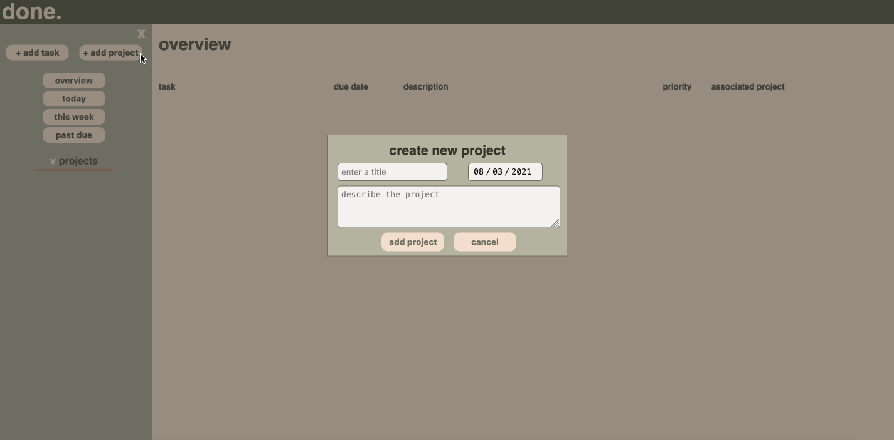

# todo list

this is project 4 from the odin project's full stack javascript curriculum.

## project objectives

1. create the ubiquitous CRUD application that is capable of creating, reading, updating and deleting data.
2. organize tasks into projects or into a general overview of all tasks.
3. create functionality to sort tasks by date.
4. leverage a solution to store user data.

## technologies used

 
 

 

## app features

1. users can create, edit and delete both projects and tasks.
2. users can sort tasks by tasks due today, tasks due this week, and tasks past due. this functionality makes use of the [date-fns](https://date-fns.org/) library.
3. leverages localStorage to store and retrieve user data.
4. users can expand/condense the navigation menu and the project list.

## areas for improvement

1. text and form modals are too small on mobile devices.
2. a strikethrough option for completed tasks would be a nice feature. i personally like the satisfaction of seeing a completed list and the evidence of its completed tasks.
3. has overflow issues for long descriptions and titles which affects the alignment/aesthetic of the app. possible remedies include limiting characters and/or wrapping text.

## live version

[click here](https://jernestmyers.github.io/todo-list/) for a live version!
